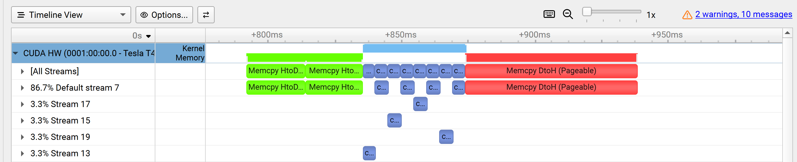
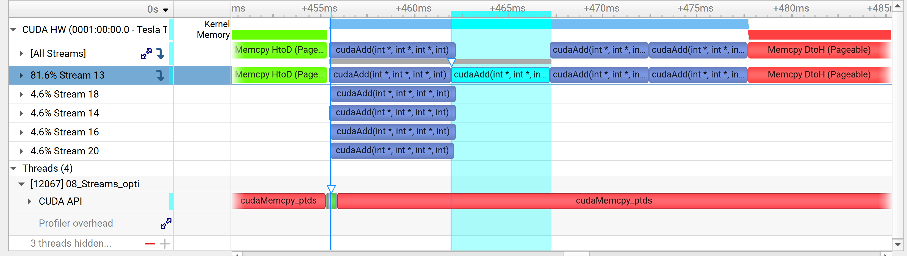
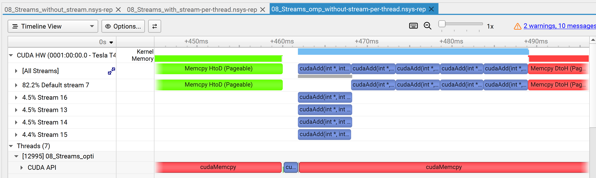

# Oberservations

## Without default-stream per-thread

We see that the kernel-runs on the default thread is sychronzing and affecting the kernel-runs which runs on a non-defult kernel.

## With default-stream per-thread

There is no effect of blocking / syncing between the streams. But somehow the stream13 runs multiple kernels sequentially (this because this is the newly created default non-default stream).

## OMP - Without default-stream per-thread

Looks same as with-default per-thread but without eabling it, but OMP seams to be a bit slower.

## OMP - With default-stream per-thread
don't see chnages to previous version